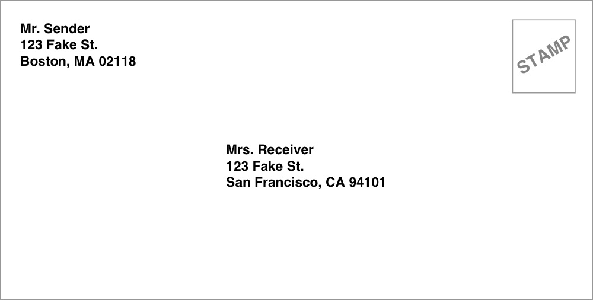

Create an ***Envelope*** component that takes `toPerson` and `fromPerson` as
props and uses your ***AddressLabel*** from Exercise 1 to display the *return
address* and the *recipient address*. Make sure to include a *`Stamp`* too!  
