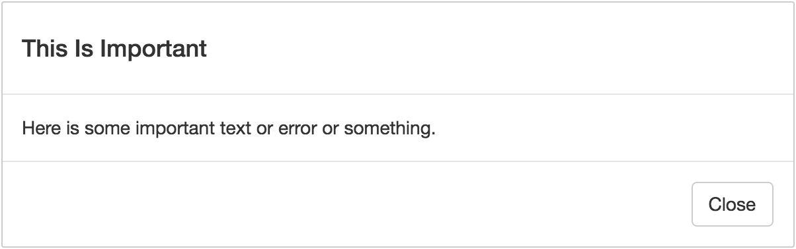

Create a Dialog component which accepts as children Title , Body , and
Footer components, all optional. Dialog should verify that all of its
children are one of these types, and should output something that looks like
this:  

  

Feel free to use Bootstrap’s modal styles, or create your own.