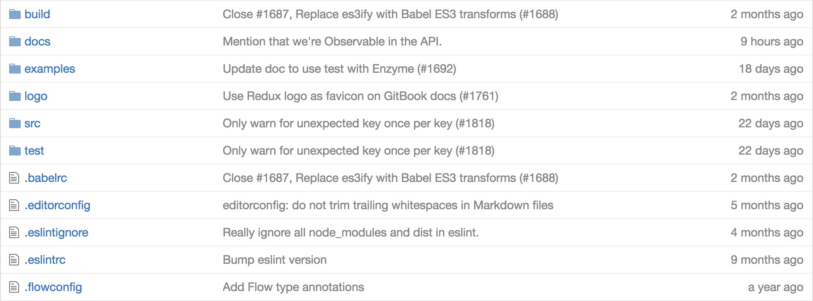

In real applications, you’ll want to have only one component per file most
of the time. Sometimes a file will contain a few related components, when
those components are always used together, but otherwise they should be 
separated out. Refactor the code from `GithubFileList` to pull out components 
into separate files, using `import` and `export`.  

